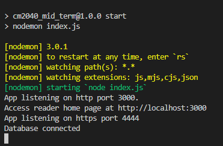

# CM2040 Database Networks and the Web Mid Term Coursework
#### This is my mid term Nodejs web application for 2023 DnW mid term courswork
#### Marks: 92.8%

The coursework_submission folder contains my report and demonstration video.

## Installation requirements 
Run the command to install the dependencies
```bash
$ npm install 
```

## How to run the aplication 

### Adding environmental variables
create a .env file and add the environmental variables into the file
```
// file named .env
HTTP_PORT=3000
HTTPS_PORT=4444
SESSION_SECRET='EWTmci/VKCijJjjsJQeQIvUDmjqnVSCTk1Kbh5foteo='
```
### Building the sqlite db 
If you are a *windows* user, you would need to edit the ```build-db``` and ```clean-db``` npm script in the package.json.
```json
 "scripts": {
    // other scripts.... 
    // change linux cmds to win cmds
    "build-db": "type db_schema.sql | sqlite3 database.db",
    "clean-db": "del database.db | del sessions.db",
 }
```

Now, to create the sqlite3 database (database.db), run the code:
```bash 
$ npm run build-db
``` 

### starting the node server
Run the command to start the node server
```bash 
$ npm start
``` 
This should be the output in your terminal when npm start runs successfully
<br>

<br>
You can access the reader home page via http://localhost:3000

At the moment, there are no published articles so you need to login to an author account by clicking on the login button or access via http://localhost:3000/auth/login

You do not have an account? click on the register link below the login button to create a new user or access via http://localhost:3000/auth/register

Once you have successfully registered, you will be redirected to the author page.

### *Optional:* cleaning the db
you can delete the databases before rebuilding it for a fresh start 
```bash
$ npm run clean-db
```


## Others
### code documentation
You can view my [code documentation](http://htmlpreview.github.io/?https://github.com/barnabas243/dnw_midterm/blob/main/docs/index.html) here or open it from the docs/index.html with a html viewer on your local machine.

It is generated using JSDocs and the DocDash template.


